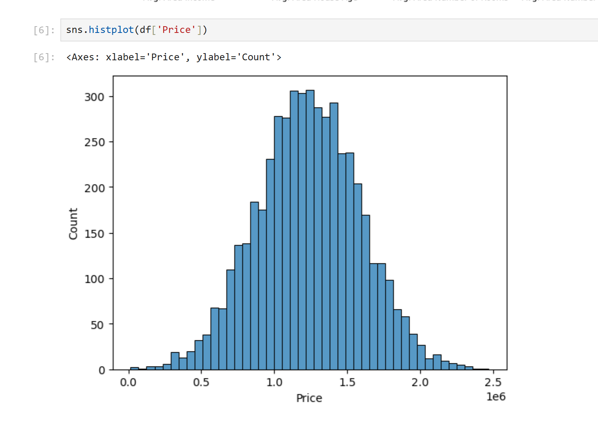
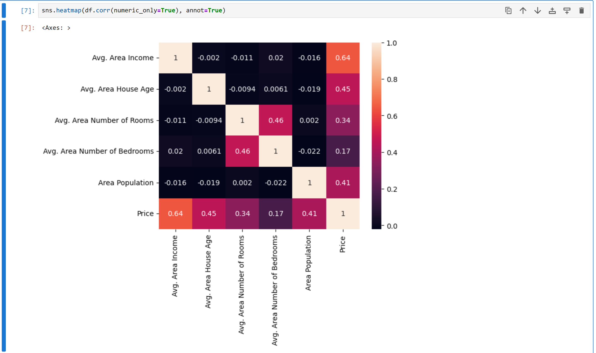
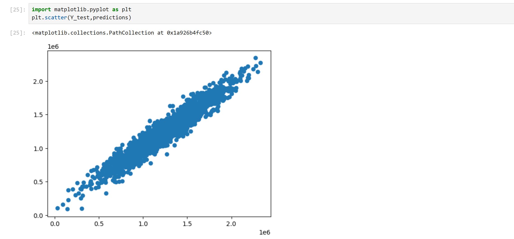
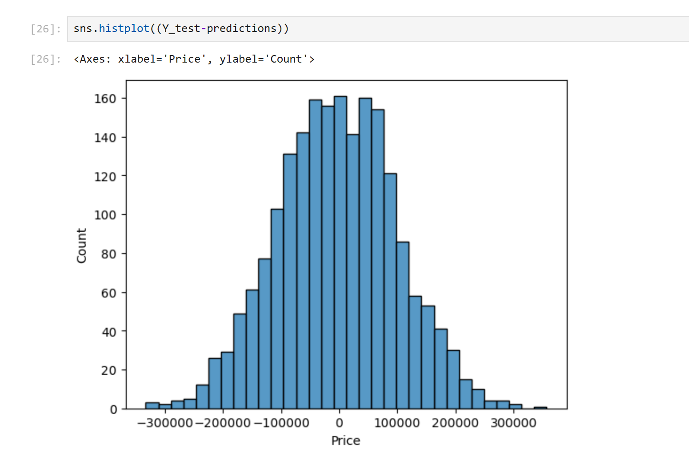

<h1> This project is for Exploratory data analysis for a Hosing dataset </h1>
<h2> Section 1 : The linear Regression part </h2>

The liear regression is primarily  used to model the relationship between a dependent variable and one or more independent variables. Its main goal is to predict or explain how the dependent variable changes when the independent variables change. 
    

 In our script, we used this Linear Regression Algorithm to predict the Price of a house based on other properties :  ['Avg. Area Income', 'Avg. Area House Age', 'Avg. Area Number of Rooms',
       'Avg. Area Number of Bedrooms', 'Area Population'] 

<h3>The following plot is a seaborn histplot , it represents the count of Houses with each price </h3>  

<h3>The following plot is a seaborn heatmap , it represents the Correlation between propreties of our housing data frame </h3>  

<h3>The following plot is a matplolib Scatter plot , After training the data, the data points are getting closer to the linear graph, </h3>  

<h3>The following plot is a matplolib Scatter plot , After training the data, the data points are getting closer to the linear graph, </h3>  

